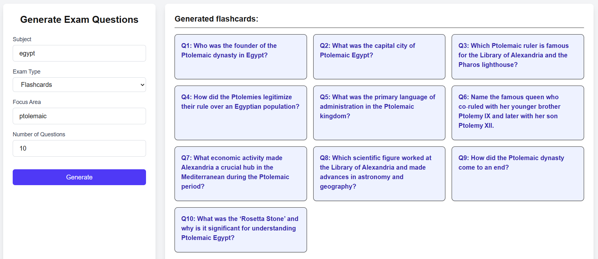
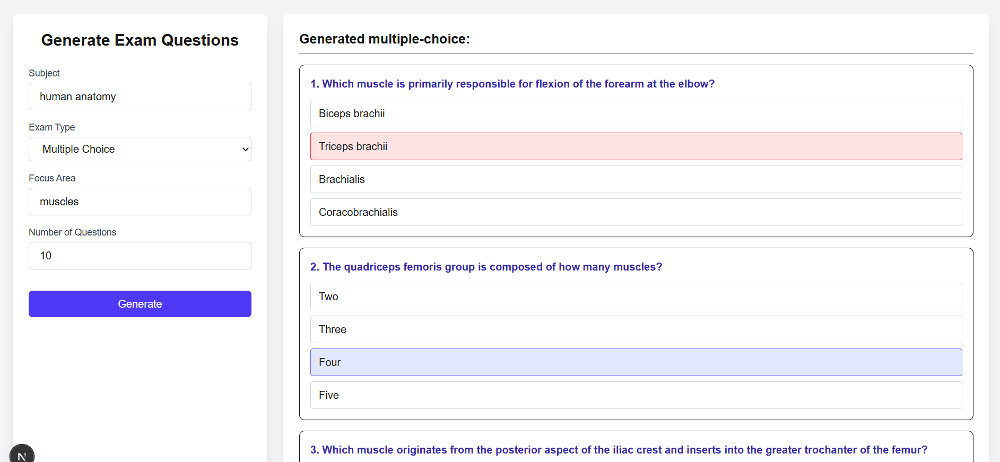
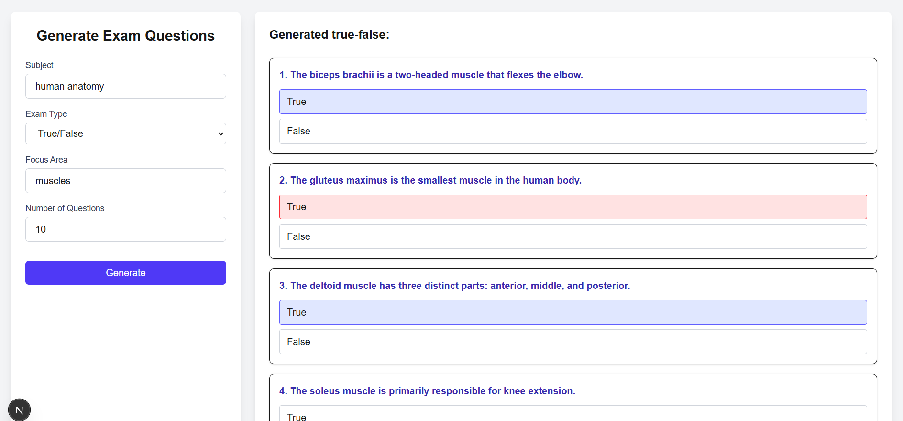

# Quizzardry

An interactive front-end application that generates study materials (flashcards, multiple-choice, and true/false questions) using an LLM hosted on **Ollama**.  
The project uses a **React** front end, an **Express** back end, and integrates with Ollama through a custom API.

---

## Features

- Generate flashcards, multiple-choice, or true/false exam questions.
- Select subject, focus area,academic level, and number of questions.
- Interactive UI with answer selection and correctness feedback.
- Back-end API powered by **Express**.
- LLM communication via **Ollama** (using `gpt-oss:120b`).

---

## UI





---

## Demo

<p align="center">
  <a href="https://www.youtube.com/watch?v=mh8hKno4xVM">
    
  </a>
  <br>
  Click to watch the demo
</p>

---

## Tech Stack

- **Frontend**: React (Next.js optional), Tailwind CSS
- **Backend**: Node.js, Express
- **LLM**: Ollama (`gpt-oss:120b`)
- **Networking**: Tailscale for secure host connection

---

## API Endpoints

| Method | Path    | Description                         | Request Body                                                                                                             |
| ------ | ------- | ----------------------------------- | ------------------------------------------------------------------------------------------------------------------------ |
| POST   | `/quiz` | Generate exam questions with Ollama | `{ model: "gpt-oss:120b", messages: [ {role: "system", content: "..."}, {role:"user", content:"..."} ], stream: false }` |

**Response Example:**

```json
{
  "model": "gpt-oss:120b",
  "message": {
    "role": "assistant",
    "content": "[{ \"question\": \"...\", \"answer\": \"...\" }]"
  }
}
```
