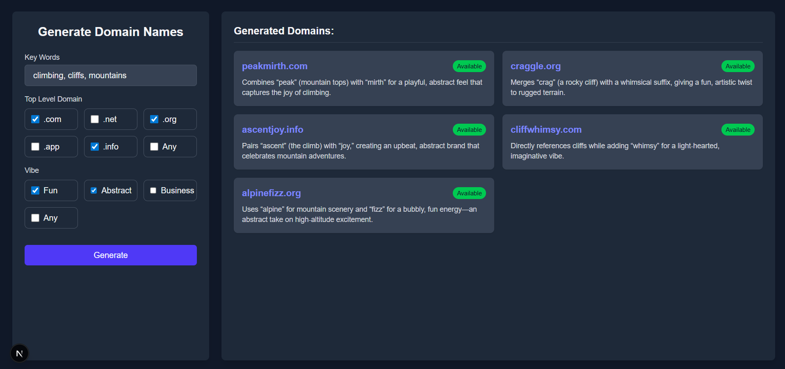

# Domain Name Generator

An interactive front-end application that generates **domain name suggestions** using an LLM hosted on **Ollama**.  
The project uses a **React** front end, an **Express** back end, custom tools, the **Domainr API** for availability checks, and integrates with Ollama through a custom API.  
**Now powered by [LangGraph](https://js.langchain.com/docs/langgraph/), enabling dynamic agent workflows and tool use.**

---

## Features

- Generate **creative domain name ideas** based on:
  - Keywords
  - Desired TLDs (`.com`, `.net`, `.org`, `.app`, etc.)
  - Style/Vibe (Fun, Abstract, Business, Any)
- Interactive UI for inputting preferences.
- Real-time feedback with domain availability (via Domainr API).
- Back-end API powered by **Express** and **LangGraph** for agentic reasoning.
- LLM communication via **Ollama** (using `gpt-oss:20b`).
- **Dynamic decision-making** using LangGraph conditional edges.
- **Four custom tools**:
  - `searchDomains`: Suggests domain names based on user input.
  - `getDomainStatus`: Checks domain availability using the Domainr API.
  - `rankDomains`: Scores and ranks domains based on quality, length, and TLD popularity.
  - `checkTrademarks`: Screens domains for potential trademark conflicts.
- Uses **LangGraph** to orchestrate tool calls and LLM reasoning, ensuring output is valid JSON, properly structured, and consistently formatted.

---

## UI



---

## Demo

<p align="center">
  <a href="https://www.youtube.com/watch?v=fRpmz3BXcNc">
    
  </a>
  <br>
  Click to watch the demo
</p>

---

## Tech Stack

- **Frontend**: React (Next.js optional), Tailwind CSS
- **Backend**: Node.js, Express, **LangGraph**
- **Domainr API**: For checking domain name availability
- **LLM**: Ollama (`gpt-oss:20b`)
- **Networking**: Tailscale for secure host connection

---

## API Endpoints

| Method | Path       | Description                      | Request Body                                                                                                      |
| ------ | ---------- | -------------------------------- | ----------------------------------------------------------------------------------------------------------------- |
| POST   | `/domains` | Generate domain name suggestions | `{ model: "gpt-oss:20b", messages: [{role:"system",content:"..."}, {role:"user",content:"..."}], stream: false }` |

**Response Example:**

```json
{
  "suggestions": [
    {
      "domain": "roamly",
      "tld": ".com",
      "reason": "Short, playful, and tied to travel/adventure",
      "available": true,
      "score": 14,
      "trademarkStatus": "Clear"
    },
    {
      "domain": "ventureverse",
      "tld": ".net",
      "reason": "Abstract and modern name for adventurous experiences",
      "available": false,
      "score": 9,
      "trademarkStatus": "Clear"
    },
    {
      "domain": "amazingtravel",
      "tld": ".com",
      "reason": "Descriptive of amazing travel experiences",
      "available": true,
      "score": 11,
      "trademarkStatus": "Potential Conflict"
    }
  ],
  "ranking": {
    "top": {
      "domain": "roamly.com",
      "score": 14
    }
  },
  "trademarkResults": {
    "conflictCount": 1,
    "safeDomains": ["roamly.com", "ventureverse.net"]
  }
}
```

---

## How It Works

- The backend uses **LangGraph** to create a dynamic agent that can reason about user input and decide which tools to call.
- The agent can:
  1. Use the `searchDomains` tool to generate domain name ideas.
  2. Use the `getDomainStatus` tool to check if those domains are available.
  3. **Make intelligent decisions** using the `makeDecision` tool to choose between:
     - Ranking domains by quality (using the `rankDomains` tool)
     - Checking domains for trademark conflicts (using the `checkTrademarks` tool)
  4. Return a structured JSON response for the frontend to display.
- LangGraph's **conditional edges** allow the workflow to branch based on LLM decisions.

---
